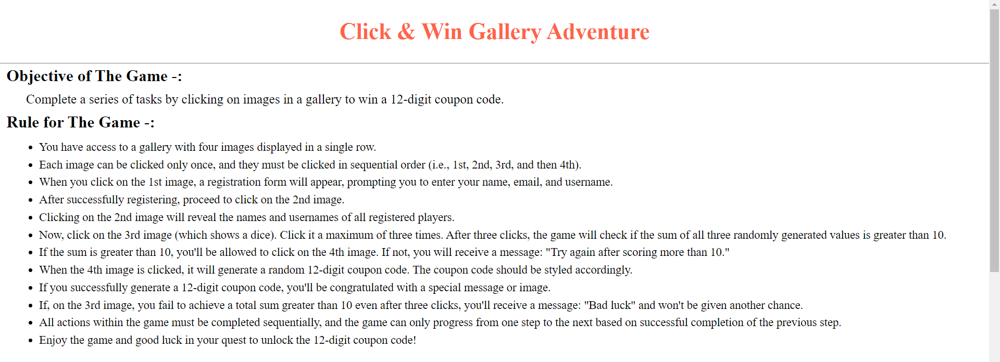
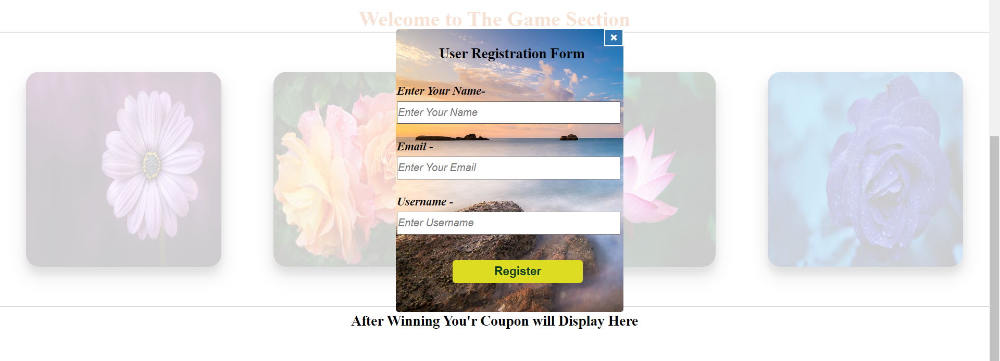
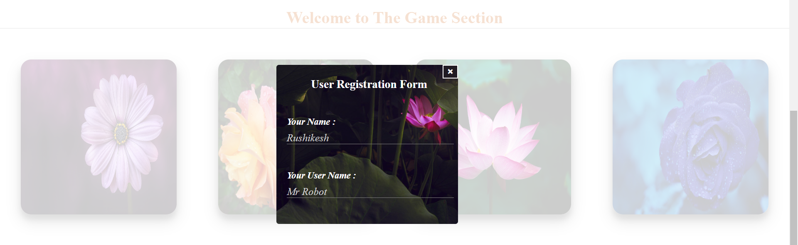
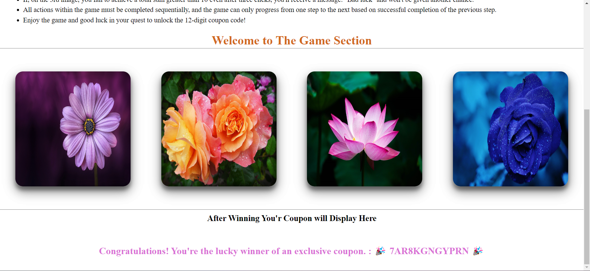

# Project Title: Interactive Gallery with Registration and Coupon Generation

# Introduction

1. Project Overview
- This project is an interactive web application that features a gallery with four images. Users can interact with the images in a specific order, triggering various actions such as registration, displaying registered user information, rolling dice, and generating a coupon code.

2. Purpose and Scope
- The purpose of this project is to create an engaging and interactive web application that combines image-based interaction with user registration and randomization features. It aims to provide entertainment and potentially reward users with a coupon code.

3. Technologies Used

<ol type="i">
    <li>HTML5</li>
    <li>CSS3</li>
    <li>JavsScript</li>
</ol>

# Features -:
- Gallery Display
- Display four images in a single row.
- Registration Form
- Clicking the first image reveals a registration form where users can enter their name, email, and username.
- Display Registered User Info
- Clicking the second image displays the registered user's name and username.
- Dice Roll and Scoring Logic
- Clicking the third image (a dice) randomly generates a number between 1 and 6, inclusive.
- Users can click the image up to three times.
- To proceed to the fourth image, the sum of the three generated numbers must be greater than 10.
- If the sum is not greater than 10, a message "Try again after scoring more than 10" is displayed.
- Coupon Generation
- Clicking the fourth image generates a random 12-digit text as a coupon.
- User Feedback Messages
- Provide feedback messages for user actions and outcomes, including congratulations for generating a coupon and messages for failed attempts.
- Sequential Image Clicking
- Images can only be clicked once and in a specific order.

# Screenshots -:

1. <b>Homepage-:</b>
  

2. <b>Registration Form -:</b> 

  
3. <b>Display Form -: </b>

4. <b>Main Section -: </b>

  
# Live Link -:

<a href="./https://mrrushikesh.github.io/Rushikesh_Ingale_DOM_1_28th_Sept_2023/" target="_blank">
